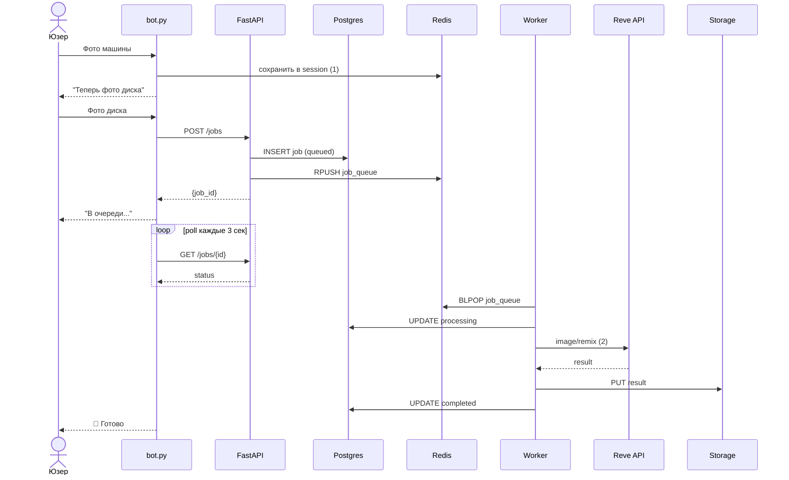
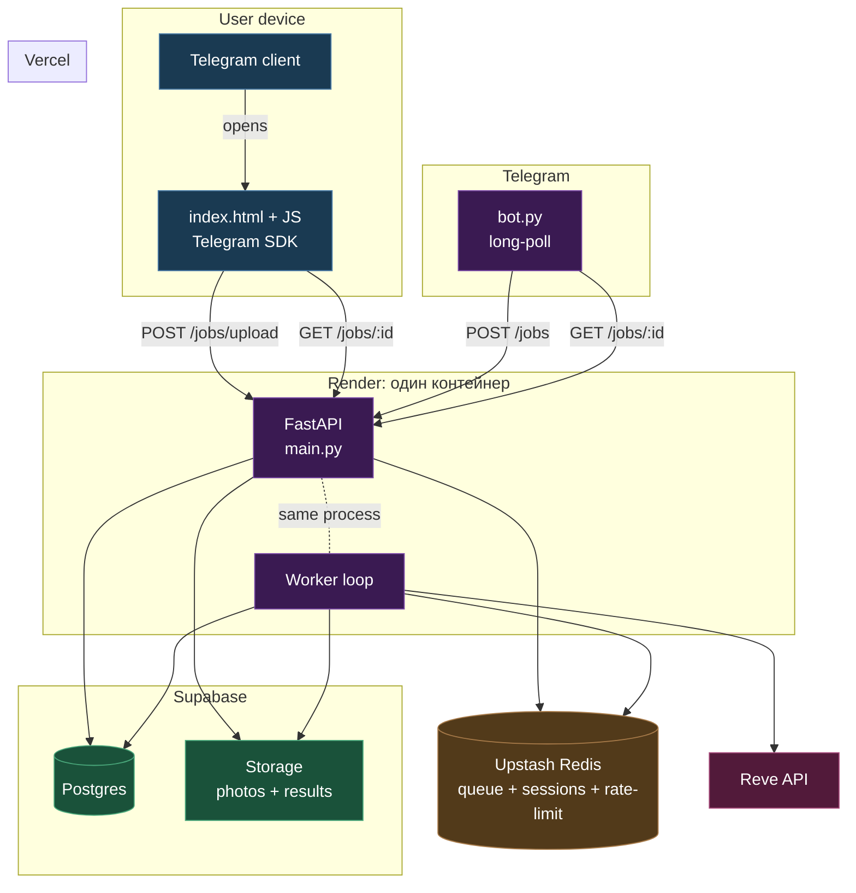
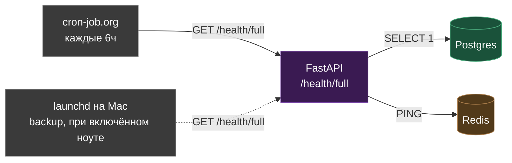
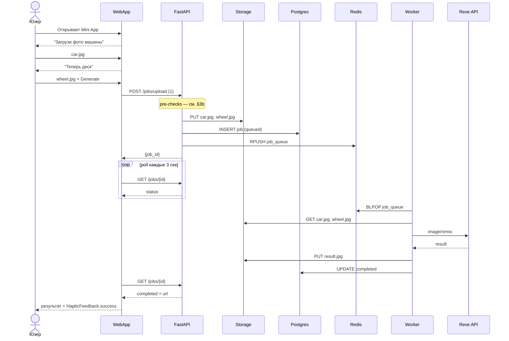
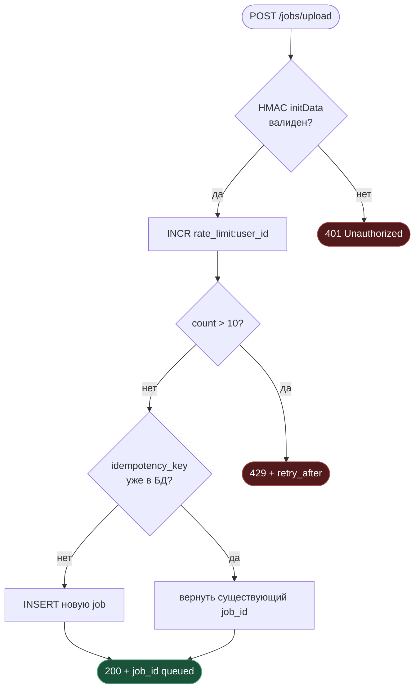
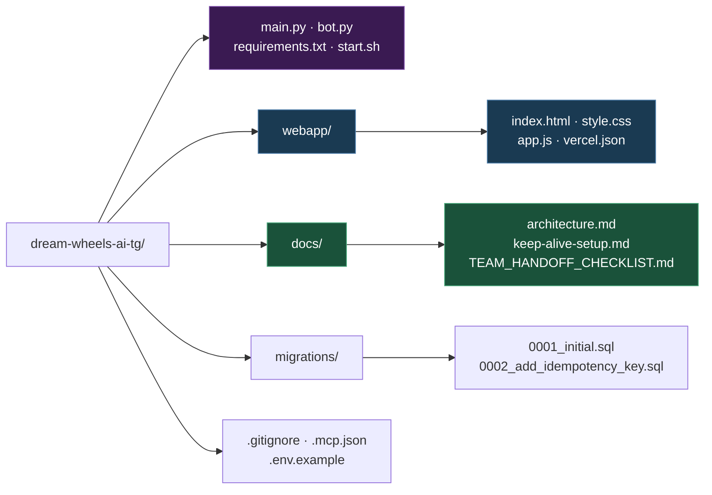
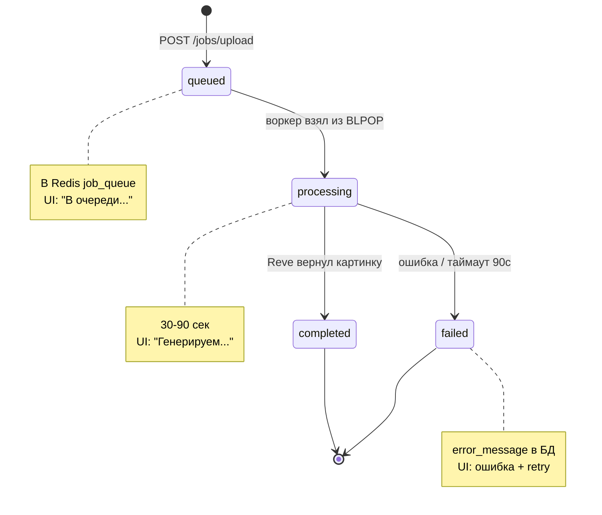
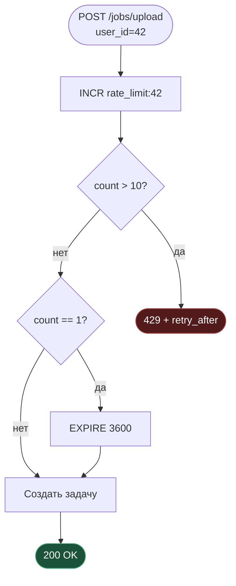

# Dream Wheels AI — архитектура

Диаграммы рендерятся:
- На **GitHub** автоматически в UI
- В **VS Code** через расширения:
  - `bierner.markdown-mermaid` (Markdown Preview Mermaid Support) — рендерит в стандартном Markdown Preview (`Cmd+Shift+V`)
  - `tomoyukim.vscode-mermaid-editor` — отдельный live-preview
- На https://mermaid.live можно вставить код и экспортнуть PNG/SVG

**Цветовая палитра** (используется во всех диаграммах ниже):
- 🔵 синий — frontend / клиент (WebApp, Telegram client)
- 🟣 фиолетовый — backend (FastAPI, Worker)
- 🟢 зелёный — данные (Postgres, Storage)
- 🟠 оранжевый — Redis (очередь, кэш, rate-limit)
- 🔴 красный — внешние API (Reve)
- ⚪ серый — ops/инфра (keep-alive, monitoring)

---

## 1. Текущий пайплайн (Telegram bot only)

Как сейчас работает прод, до WebApp.

**Сноски:**
1. `SETEX session:{user_id}:car_url 600` — TTL 10 минут на сессию между двумя фото.
2. `POST /image/remix` с двумя фото в base64.

---

## 2. Целевая архитектура с WebApp — data plane

После реализации Telegram WebApp на Vercel. Здесь — основной поток запрос→ответ. Ops (keep-alive, мониторинг) вынесен в §2b.

---

## 2b. Ops plane — keep-alive

Render Free засыпает после 15 минут без запросов. Чтобы бот и API не «лагали» при первом обращении после простоя — внешний пинг каждые 6 часов.

Подробности — [keep-alive-setup.md](keep-alive-setup.md).

---

## 3. Поток создания задачи через WebApp — happy path

Что происходит когда юзер тапает Generate в Mini App. Pre-checks (валидация initData, rate-limit) вынесены в §3b.

**Сноски:**
1. `FormData: car, wheel, idempotency_key` + header `X-Telegram-Init-Data`.

---

## 3b. Pre-checks — auth + rate-limit + idempotency

Что делает FastAPI до того как принять задачу.

---

## 4. Структура репозитория

---

## 5. Состояния задачи (job lifecycle)

Все возможные переходы статуса в таблице `jobs`.

---

## 6. Rate limiting через Redis

Лимит 10 генераций в час на юзера.

Ключ `rate_limit:{user_id}` живёт 1 час. После истечения — счётчик сбрасывается.

---

## Как просматривать в VS Code

1. Установи **Markdown Preview Mermaid Support** (`bierner.markdown-mermaid`)
2. Открой этот файл, `Cmd+Shift+V` — preview справа

## Как экспортировать в PNG/SVG

1. https://mermaid.live
2. Скопируй содержимое `mermaid` блока без бэктиков
3. **Actions** → PNG или SVG
