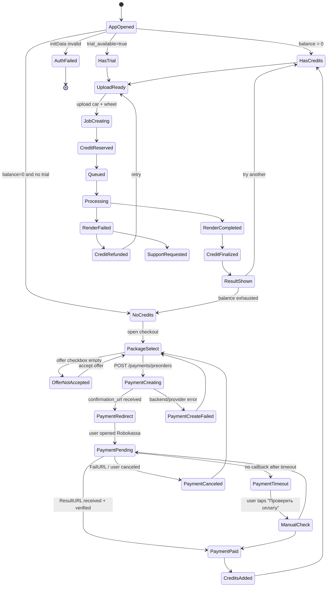
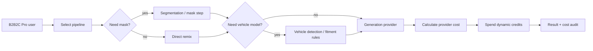
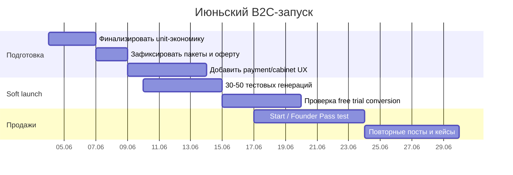
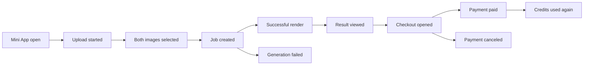

# Dream Wheels AI — B2C-стратегия, unit-экономика и июньский запуск

Статус: локальный рабочий документ, версия 0.1.

Scope: только B2C Telegram Mini App. B2B-сайт, виджет для магазинов и дилерские
интеграции сознательно вынесены за рамки этого документа.

Документ не содержит ФИО, ИНН, ключей, паролей Robokassa, токенов Telegram,
URL баз данных и других приватных данных.

## 1. Базовая позиция

Dream Wheels AI нужно продавать не как “AI image generator”, а как практический
инструмент выбора дисков:

> Примерь диски на свою машину перед покупкой.

Ключевая ценность для B2C-пользователя:

- меньше риска купить диски, которые плохо смотрятся на машине;
- быстрый визуальный ответ без Photoshop и без общения с дизайнером;
- результат можно обсудить с друзьями/в авто-чате перед покупкой.

Рабочий маркетинговый тезис:

> Загрузи фото машины и фото диска — получи визуальную примерку за несколько
> минут.

## 2. Принципиальное решение по продуктовой модели

Рекомендуемая модель для июня: **credits**, а не безлимит.

Почему:

- каждый render имеет прямую себестоимость через внешний API;
- качество может требовать повторных попыток;
- безлимит создает риск heavy-user abuse;
- Robokassa/оферта требуют ясно описать, что именно покупает пользователь;
- credits проще юридически, технически и экономически контролировать.

Founder Pass можно оставить как маркетинговую механику, но он должен быть
выражен через credits и срок действия, а не через настоящий безлимит.

Рабочее решение:

```text
Пользователь покупает пакет render credits.
1 credit = 1 попытка получить итоговый render.
Если техническая ошибка сервиса не дала результата, credit возвращается.
```

Вопрос для утверждения:

```text
Списывать credit при создании job и возвращать при failure
или списывать только после completed?
```

Практическая рекомендация: **резервировать credit при создании job, окончательно
списывать при successful result, возвращать при technical failure**. Это защищает
от double tap/retry и при этом честно для пользователя.

## 3. Финальный B2C pipeline

```mermaid
sequenceDiagram
    autonumber
    actor U as Пользователь
    participant App as Telegram Mini App
    participant API as FastAPI Backend
    database DB as Postgres
    participant Redis as Redis Queue
    participant Worker as Worker
    participant AI as External Image API
    participant Pay as Robokassa

    U->>App: Открывает Mini App
    App->>API: Проверка Telegram initData
    API-->>App: user profile + balance + trial status

    alt Есть credits или free trial
        U->>App: Загружает фото машины и диска
        App->>API: POST /jobs/upload
        API->>DB: Резервирует 1 credit / trial
        API->>DB: Создает job со статусом queued
        API->>Redis: RPUSH job_queue
        API-->>App: job_id

        Worker->>Redis: BLPOP job_queue
        Worker->>DB: status=processing
        Worker->>AI: car image + wheel image
        AI-->>Worker: result image или error

        alt Успешный render
            Worker->>DB: status=completed, credit finalized
            App->>API: GET /jobs/{job_id}
            API-->>App: completed + result_url
            App-->>U: Показывает результат
        else Техническая ошибка
            Worker->>DB: status=failed, credit refunded
            App->>API: GET /jobs/{job_id}
            API-->>App: failed + credit_refunded
            App-->>U: Повторить без доплаты или обратиться в поддержку
        end
    else Нет credits
        App-->>U: Экран выбора пакета
        U->>App: Email + пакет + согласие с офертой
        App->>API: POST /payments/preorders
        API->>DB: preorder status=pending
        API-->>App: Robokassa confirmation_url
        App->>Pay: Открывает оплату
        Pay->>API: POST /payments/robokassa/result
        API->>DB: preorder status=paid, начислить credits
        API-->>Pay: OK<invoice_id>
        App->>API: GET /payments/preorders/{id}
        API-->>App: paid + credits_added
        App-->>U: Оплата прошла, credits доступны
    end
```

## 4. UX state map

Эта карта нужна до дизайна экранов: она задает, какие состояния обязан покрыть
frontend.



Минимальные frontend-состояния:

| State | Что видит пользователь |
| --- | --- |
| `no_credits` | Экран выбора пакета / free trial CTA |
| `package_select` | Пакеты, email, оферта, цена |
| `payment_pending` | “Ждем подтверждение Robokassa” + manual check |
| `payment_paid` | “Оплата прошла, credits начислены” |
| `payment_timeout` | “Проверяем оплату дольше обычного” |
| `upload_ready` | Загрузка машины и диска |
| `queued/processing` | Генерация |
| `completed` | Результат + download/share |
| `failed_refunded` | Ошибка, credit возвращен |
| `receipt_pending` | Чек формируется |
| `receipt_issued` | Ссылка на чек |

## 5. Unit-экономика: модель расчета

До выбора цен нужно знать фактическую себестоимость одного успешного render.
Для июньского B2C-запуска базовый расчет строим на **Reve 1.1 / Remix**:
пользователь не выбирает модель или пайплайн, продукт сам использует наиболее
стабильный средний сценарий.

B2B2C Pro-модель выносим отдельно: там можно будет выбирать пайплайн генерации
и списывать разное число credits в зависимости от себестоимости.

### 5.1 Переменные

| Переменная | Значение | Что означает |
| --- | ---: | --- |
| `reve_credit_usd` | `$10 / 7500 = $0.001333` | Цена одного Reve API credit из кабинета |
| `reve_remix_fast_credits` | `5` | Быстрая попытка Remix |
| `reve_remix_credits` | `30` | Базовая попытка Remix |
| `api_cost_attempt` | `$0.040` | Средняя стоимость одной попытки генерации: текущий backend использует обычный Reve Remix |
| `attempts_per_success` | `2.0` | Грубая оценка вверх до теста 30-50 пар |
| `technical_failure_rate` | `15%` | Грубая оценка вверх |
| `payment_fee_rate` | `5%` | Грубая оценка вверх до финального тарифа Robokassa |
| `payment_fee_fixed` | `0 ₽` | Если Robokassa добавит фиксированную часть, обновить |
| `infra_monthly` | `3000 ₽` | Грубый резерв на Render/Supabase/Redis/Storage |
| `paid_renders_month` | `1000` | Плановая база для распределения infra cost |
| `support_buffer_render` | `5 ₽` | Резерв на поддержку и спорные случаи |
| `free_trial_renders` | `100` | Стартовый месячный cap бесплатных renders |
| `refund_rate` | `5%` | Грубая оценка вверх |

### 5.1.1 Reve 1.1 planning cost

Предварительные цены из личного кабинета Reve:

| Операция | Credits | USD / attempt | Роль |
| --- | ---: | ---: | --- |
| `remix_fast` | 5 | `$0.0067` | Дешевый быстрый baseline, если качество проходит |
| `remix` | 30 | `$0.0400` | Основной quality baseline для B2C |

Для B2C в checkout не показываем пользователю “модель” или “режим”. Он покупает
render credits, а backend использует текущий стабильный пайплайн. На 2026-06-09
в коде используется обычный `reve_remix`, не `remix_fast`.

```text
api_cost_attempt_avg =
  share_remix_fast * 0.0067
  + share_remix * 0.0400
  + share_fallback * fallback_attempt_cost
```

Начальная planning-гипотеза до тестов:

```text
share_remix_fast = 0%
share_remix = 100%
share_fallback = 0%

api_cost_attempt_avg =
  1.00 * 0.0400 = $0.0400
```

При курсе `usd_rub`:

```text
api_cost_attempt_rub = api_cost_attempt_avg * usd_rub
```

Эта гипотеза должна быть заменена фактом после 30-50 тестовых генераций и далее
обновляться раз в месяц по production usage.

Грубый расчет вверх для старта:

```text
usd_rub = 100
api_cost_attempt_rub = 0.0400 * 100 = 4 ₽
attempts_per_success = 2.0
api_cost_success = 8 ₽
infra_cost_per_render = 3000 / 1000 = 3 ₽
support_buffer_render = 5 ₽
cogs_per_success = 16 ₽
```

### 5.2 Формулы

```text
api_cost_success =
  api_cost_attempt * attempts_per_success

infra_cost_per_render =
  infra_monthly / max(paid_renders_month, 1)

cogs_per_success =
  api_cost_success
  + infra_cost_per_render
  + support_buffer_render

payment_fee =
  package_price * payment_fee_rate
  + payment_fee_fixed

package_cogs =
  included_credits * cogs_per_success

contribution_margin =
  package_price
  - payment_fee
  - package_cogs

margin_percent =
  contribution_margin / package_price

free_trial_budget =
  free_trial_renders * cogs_per_success
```

### 5.2.1 Динамическое среднее для B2C

Сейчас стоит **спроектировать** динамическое среднее, но не автоматизировать его
в P0. Для запуска достаточно зафиксировать manual monthly value в конфиге
пакетов.

Целевой расчет после накопления usage:

```text
monthly_api_cost_attempt_avg =
  sum(provider_cost_usd) / count(generation_attempts)

monthly_attempts_per_success =
  count(generation_attempts) / count(successful_renders)

monthly_cogs_per_success =
  monthly_api_cost_attempt_avg
  * monthly_attempts_per_success
  * usd_rub
  + infra_cost_per_render
  + support_buffer_render
```

Использование:

- B2C: цена пакетов пересматривается раз в месяц по среднему.
- Admin: показывает фактический `cost_per_success` и отклонение от planning.
- Backend: в момент покупки использует текущую версию `package_config`, чтобы
  условия оплаты не менялись задним числом.

### 5.3 Решающее правило

Пакет нельзя запускать, если:

- contribution margin отрицательная в базовом сценарии;
- heavy-user сценарий может съесть API-бюджет;
- backend не умеет технически ограничить обещанный тариф;
- текст оферты, checkout и backend расходятся;
- unclear refund policy.

## 5.4 B2B2C Pro: selectable generation pipeline

B2B2C Pro не должен использовать усредненный B2C-подход. Там ценность выше:
магазин/партнер может выбирать качество, скорость и дополнительные этапы.

Пример будущей матрицы списания:

| Pipeline | Состав | Provider cost | Credit spend | Для кого |
| --- | --- | ---: | ---: | --- |
| Fast preview | `reve_remix_fast` | низкий | 1x | быстрый каталог/первичный просмотр |
| Standard fit | `reve_remix` | средний | 3-5x | основной B2B2C режим |
| Masked fit | segmentation mask + `reve_remix` | выше | 5-8x | лучшее сохранение кузова/дисков |
| Vehicle-aware | автоопределение модели + pipeline rules | выше | 6-10x | витрины, где важна точность fitment |
| Premium fallback | OpenAI / другой high-quality provider | высокий | dynamic | ручной retry/high-value leads |

Логика списания credits:

```text
credit_spend =
  ceil((provider_cost + infra_cost + support_buffer) / internal_credit_cost)
```

Для B2B2C это означает не “один render = один credit”, а “каждый pipeline имеет
понятную цену в credits”. Это лучше для партнеров: они сами выбирают скорость,
качество и стоимость.



## 6. Какие данные нужно собрать до финальных цен

Без этих чисел тарифы будут гаданием:

| Данные | Как получить |
| --- | --- |
| Фактическая цена одной API-попытки | тариф внешнего API + лог usage |
| Среднее `attempts_per_success` | прогнать 30-50 реальных пар фото |
| Failure rate | считать `failed / total_jobs` |
| Среднее время генерации | логировать queued/processing/completed timestamps |
| Комиссия Robokassa | договор/кабинет Robokassa |
| Free trial conversion | после первой недели запуска |
| Конверсия upload → successful render | аналитика Mini App |
| Конверсия result → checkout | аналитика Mini App |
| Конверсия checkout → paid | backend payment events |

Минимальный тест качества перед маркетингом:

```text
30-50 реальных пар "машина + диск"
для каждой пары:
- successful / failed
- нужно ли повторить
- субъективное качество 1-5
- пригодно ли для публикации
```

## 7. Тарифная стратегия на июнь

### 7.1 Что не запускать сейчас

Настоящий безлимит за 500 ₽ не запускать.

Причина:

- себестоимость не зафиксирована;
- нет hard cap;
- нет slow queue logic;
- нет защиты от heavy users;
- оферта должна обещать конкретную услугу, а не “почти безлимит”.

### 7.2 Что можно запускать как aggressive offer

Founder Pass можно оставить, но с прозрачным лимитом:

```text
Founder Pass June
Цена: 500 ₽
Срок: до 30 июня 2026
Включено: N render credits
После лимита: доступ к slow queue / покупка дополнительных credits
```

`N` нужно выбрать после расчета `cogs_per_success`.

Формула безопасного лимита:

```text
max_credits_for_founder_pass =
  floor((price - payment_fee - target_margin) / cogs_per_success)
```

Например, если `cogs_per_success = 60 ₽`, то за 500 ₽ нельзя честно дать
30-50 renders с нормальной маржой. Если `cogs_per_success = 10-15 ₽`, тогда
Founder Pass может быть гораздо агрессивнее.

### 7.3 Базовые пакеты-кандидаты

Не финальные цены. Таблица показывает логику, а не утвержденный прайс.

| Пакет | Роль | Цена | Credits | Условие запуска |
| --- | --- | ---: | ---: | --- |
| Free Trial | Дать magic moment | 0 ₽ | 1 | Только если есть budget cap |
| Start | Первый платный шаг | 100 ₽ | 3 | Должен иметь положительную маржу |
| Founder Pass | Июньская предоплата | 500 ₽ | TBD | Только с hard cap |
| Pro | Для активного выбора дисков | 499 ₽ | 20 | Не должен быть дешевле себестоимости |
| Master | Не нужен в первый запуск | 990 ₽ | 50 | Добавить позже после данных |

При грубых вводных выше:

| Пакет | Revenue after fee | Package COGS | Contribution margin | Margin |
| --- | ---: | ---: | ---: | ---: |
| Start: 100 ₽ / 3 credits | 95 ₽ | 48 ₽ | 47 ₽ | 47% |
| Pro: 499 ₽ / 20 credits | 474 ₽ | 320 ₽ | 154 ₽ | 31% |
| Master: 990 ₽ / 50 credits | 941 ₽ | 800 ₽ | 141 ₽ | 14% |

Вывод: Start можно делать дешевым entry-пакетом. Pro выглядит рабочим. Master
при текущих грубых вводных лучше не продвигать активно до фактического
`attempts_per_success`.

Рекомендация для июня:

1. Запустить **Free Trial: 1 render** с месячным лимитом бесплатных попыток.
2. Запустить **Start** как главный paid conversion.
3. Запустить **Founder Pass** только если рассчитан hard cap.
4. Не запускать Master до фактических данных.

## 8. Free trial policy

Рекомендация:

```text
1 бесплатный render на Telegram user_id.
Если render завершился technical failure, trial возвращается.
Если result плохой субъективно, trial не возвращается автоматически,
но пользователь может нажать "Пожаловаться на качество".
```

Почему:

- бесплатный render нужен для демонстрации ценности;
- 1 попытка ограничивает расходы;
- Telegram user_id дает базовую защиту от abuse;
- автоматический возврат только при technical failure упрощает правила.

Нужен лимит бюджета:

```text
free_trial_monthly_cap = X renders
free_trial_budget = X * cogs_per_success
```

Если бюджет исчерпан:

```text
Показывать: "Бесплатные тесты на сегодня закончились. Можно купить пакет Start."
```

## 9. Правила refund и credits

Нужно различать 3 случая.

| Случай | Credit | Деньги |
| --- | --- | --- |
| Пользователь оплатил пакет, но не использовал credits | Возможен возврат покупки | Возврат 100% по запросу |
| Job упал по технической причине | Credit возвращается | Денежный возврат только если пользователь просит и услуга не оказана |
| Результат получен, но “не понравился” | Credit не возвращается автоматически | Рассматривать вручную, не обещать автоматический refund |

Рекомендуемая формулировка для продукта:

```text
Если сервис не смог предоставить результат по технической причине, мы вернем
render credit или повторим обработку без дополнительной оплаты. Если проблема
не решена, пользователь может запросить возврат стоимости неоказанной услуги.
```

## 10. Backend deltas

Текущий backend умеет jobs и staging Robokassa preorder, но для выбранной модели
нужно добавить accounting credits.

Минимальные изменения:

| Зона | Изменение |
| --- | --- |
| DB | `packages` или backend config пакетов |
| DB | `user_credit_accounts` или поле balance на users |
| DB | `credit_ledger` для начислений/резервов/списаний/refund |
| DB | `preorders.package_id`, `credits_purchased`, `paid_at` |
| DB | `jobs.pipeline_key`, `provider`, `provider_cost_usd`, `attempts_count` |
| DB | `monthly_unit_economics_snapshots` для фиксирования среднего cost |
| API | `POST /payments/preorders` принимает `package_id`, а не amount |
| API | backend сам определяет price/credits по package_id |
| API | `GET /me/balance` или включить balance в bootstrap |
| Jobs | перед `POST /jobs/upload` проверять и резервировать credit |
| Worker | при `completed` finalize debit |
| Worker | при `failed` refund reservation |
| Admin/support | endpoint или SQL-процедура для ручной correction/refund |

Credit ledger обязателен, если хотим нормально разбирать спорные случаи.

Пример ledger-событий:

```text
purchase_grant
trial_grant
job_reserve
job_finalize
job_refund
manual_adjustment
expiration
```

Для Reve 1.1 нужно логировать не только статус job, но и фактический pipeline:

```text
pipeline_key = reve_remix_fast | reve_remix | fallback_openai | ...
provider_cost_usd = credits_used * reve_credit_usd
attempts_count = сколько provider attempts ушло на один successful render
```

Без этих полей нельзя честно обновлять среднюю себестоимость раз в месяц.

## 11. Frontend deltas

Минимальные изменения Mini App:

| Экран | Изменение |
| --- | --- |
| Home/upload | показывать balance и CTA купить credits |
| Payment | packages, email, offer checkbox, Robokassa trust text |
| Payment waiting | polling preorder status, manual check, retry open payment |
| Payment success | credits added, receipt pending |
| Payment failed | причина, return to packages |
| Cabinet | balance, payment history, render history |
| Legal | offer/privacy/refund/seller links |
| Generation | показать credit reserved/finalized/refunded states |

Polling оплаты:

```text
GET /payments/preorders/{preorder_id}
interval: 2 sec
timeout: 10 min
после timeout: "Проверить вручную"
```

## 12. Июньская маркетинговая кампания

Маркетинг до unit-экономики ограничен: нельзя масштабировать бесплатные renders,
пока не известна себестоимость.

### 12.1 Цели июня

1. Получить фактическую себестоимость successful render.
2. Проверить, понимают ли пользователи ценность после 1 бесплатного render.
3. Получить первые оплаты.
4. Собрать 10-20 качественных before/after examples.
5. Понять, какой оффер конвертит: Start или Founder Pass.

### 12.2 Этапы



### 12.3 Каналы

| Канал | Цель | CTA |
| --- | --- | --- |
| Telegram авто-чаты | Быстрый trial traffic | “1 бесплатная примерка дисков” |
| VK авто-группы | Before/after посты | “Открой Mini App” |
| Drive2 | Длинные кейсы | “Проверь свои диски” |
| Личные контакты | Первые пользователи | “Дай 2 фото, нужен feedback” |

Не покупать платный трафик до получения:

```text
cost_per_successful_render
trial_to_paid_conversion
checkout_to_paid_conversion
```

## 13. Метрики

Минимальный dashboard:



События:

| Event | Зачем |
| --- | --- |
| `app_opened` | вход в воронку |
| `upload_started` | интерес |
| `job_created` | активация |
| `job_completed` | magic moment |
| `job_failed` | качество/стоимость |
| `result_shared` | органика |
| `checkout_opened` | purchase intent |
| `payment_paid` | revenue |
| `credit_refunded` | cost/quality issue |
| `pipeline_selected` | какой generation pipeline выбран backend |
| `provider_cost_recorded` | фактическая себестоимость попытки |

Для B2C dashboard нужен monthly блок:

| Metric | Зачем |
| --- | --- |
| `avg_provider_cost_attempt_usd` | средняя цена provider attempt |
| `avg_attempts_per_success` | сколько попыток нужно на usable result |
| `avg_cogs_per_success_rub` | база для цен пакетов |
| `pipeline_mix` | доля fast/standard/fallback |
| `margin_by_package` | держится ли unit-экономика Start/Founder/Pro |

## 14. Решения, которые нужно принять перед разработкой

1. Подтвердить: credits как основная модель.
2. Подтвердить: настоящий безлимит не запускаем в июне.
3. Получить фактический `api_cost_attempt`.
4. Выбрать free trial monthly cap.
5. Выбрать Start package: цена и credits.
6. Решить, будет ли Founder Pass.
7. Утвердить credit reservation/finalization/refund logic.
8. Утвердить юридическую формулировку refund.
9. Утвердить список frontend-состояний.
10. Добавить backend credit ledger перед запуском платного traffic.
11. Для B2C утвердить стартовый pipeline mix Reve 1.1.
12. Для B2B2C Pro оставить selectable pipelines как P1/P2, не блокировать B2C запуск.

## 15. Следующий практический шаг

Не проектировать пакеты дальше, пока не заполнены 5 чисел:

```text
api_cost_attempt_avg =
attempts_per_success =
payment_fee_rate =
infra_monthly =
free_trial_budget_june =
```

После этого можно за 30 минут посчитать:

- максимальное число credits в Founder Pass;
- цену Start;
- стоит ли давать free trial;
- какой бюджет нужен на soft launch;
- при какой конверсии модель окупается.
