# Masked Wheel Replacement Evaluation

This document describes the budgeted image-generation evaluation layer after the
mask pipeline:

```text
Roboflow / YOLO candidates
  -> Qwen VLM keep/reject
  -> final binary wheel mask
  -> masked/reference-guided wheel replacement model
```

The evaluation runner is intentionally dry-run first. Paid generation only happens when
`--execute` is passed.

## Executive Summary

The practical question for this experiment was:

> Given a car photo, a reference rim photo, and a Stage 2 wheel mask, which model
> can replace only the rims while preserving the car, tires, background,
> perspective, and low-light detail?

Short answer: **`flux-s085-g25` remains the best current production candidate.**
It is not perfect, but it is the most stable across daylight and night cases.

What was actually generated:

| Family | Config / endpoint | Paid outputs? | Cases | Result |
| --- | --- | ---: | --- | --- |
| Flux Kontext | `fal-ai/flux-kontext-lora/inpaint`, `flux-s085-g25` | yes | `C1`, `C2`, `N2` plus wider sweeps | Best overall |
| Flux tuning variants | `flux-s075`, `s080`, `s085`, guidance variants | yes | daylight + night sweeps | Useful for tuning; `s075` helps night readability |
| Qwen Image Edit | `fal-ai/qwen-image-edit/inpaint` | yes | `C1`, `C2`, `N2` | Fast, but weaker rim fidelity |
| Gemini image edit | `fal-ai/gemini-3-pro-image-preview/edit` | partial | `C1`, `C2`; `N2` timeout | Not usable in this masked setup |
| Reve direct API | `https://api.reve.com/v1/image/remix` | yes | `C1`, `C2`, `N2` | Technically works, but weaker detail |
| Reve via fal.ai | `fal-ai/reve/fast/remix` | attempted | `C1`, `C2`, `N2` | Initial schema failed; config corrected afterward |
| Z-Image | `fal-ai/z-image/turbo/inpaint` | yes | wider comparison | Often drifts from black rim target |
| SDXL inpaint | `fal-ai/inpaint` | yes | model candidate sweep | Weak due to framing/aspect changes |
| OpenAI image edit | `gpt-image-2` runner | no paid outputs yet | dry-run only | Runner exists, but no generation examples yet |

So to answer the coverage question directly: **yes, besides OpenAI image edit,
we now have paid generation outputs for the main candidates we discussed:
Flux, Qwen, Gemini, and Reve.** Gemini is partial because the night case timed
out; Reve is complete through the direct API.

## Inputs And Masks

The three comparison cases were:

- `ivan-C1` - white car, daylight.
- `ivan-C2` - dark gray SUV, daylight.
- `ivan-N2` - dark car, night.

Each case uses a car source image, a Qwen VLM-filtered binary mask, and the same
rim reference image.

Reference rim used by the runs:


The masks below are the exact Stage 2 VLM-filtered wheel masks used for the
frontier comparison. White pixels indicate editable wheel areas; black pixels
should be preserved.

### `ivan-C1`

Source:

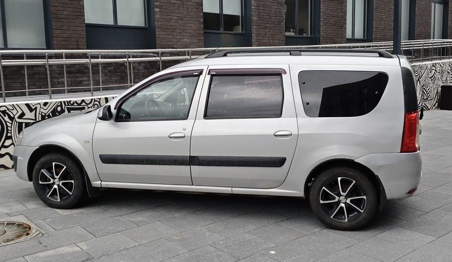

Mask:

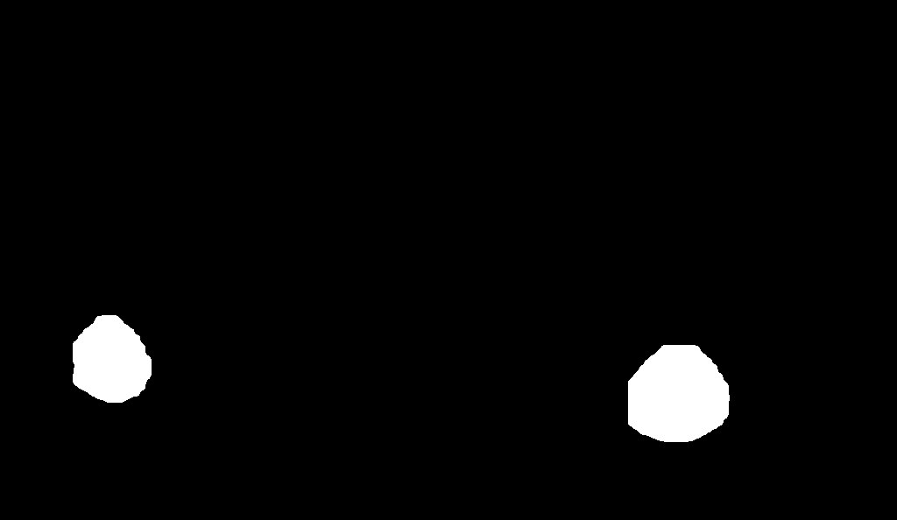

Candidate overlay before VLM filtering:


### `ivan-C2`

Source:

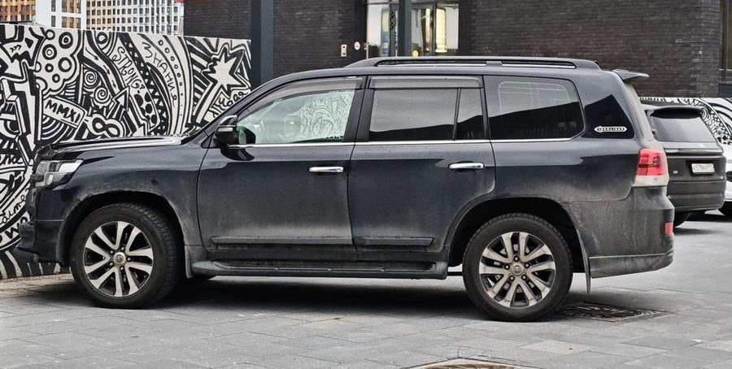

Mask:


Candidate overlay before VLM filtering:


### `ivan-N2`

Source:

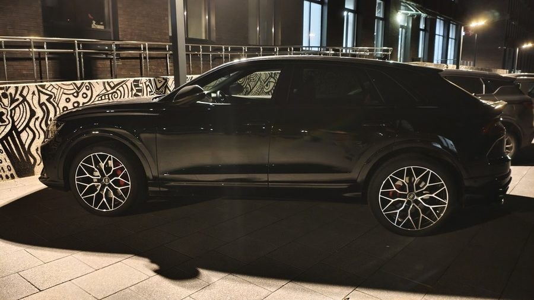

Mask:

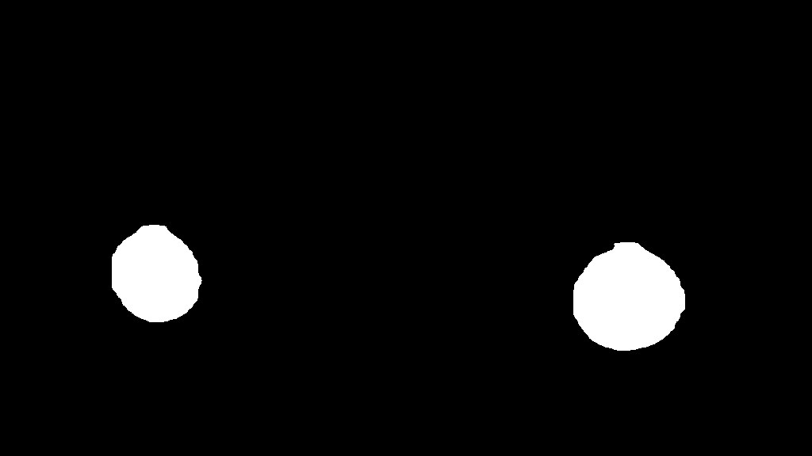

Candidate overlay before VLM filtering:


## Generation Examples By Case

The examples below use the same source car, same VLM mask, and same reference rim
inside each case. Images are intentionally shown one after another rather than
as a wide matrix, so the wheel details can be inspected.

`Gemini` is missing on `ivan-N2` because that paid request timed out at 300
seconds.

### `ivan-C1`

Source:


Mask:


Wheel source / target rim:


Flux `flux-s085-g25`:

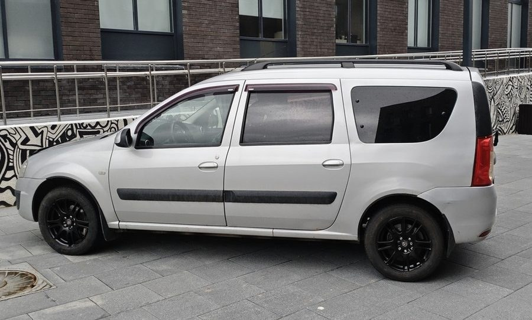

Qwen `qwen-edit-default`:

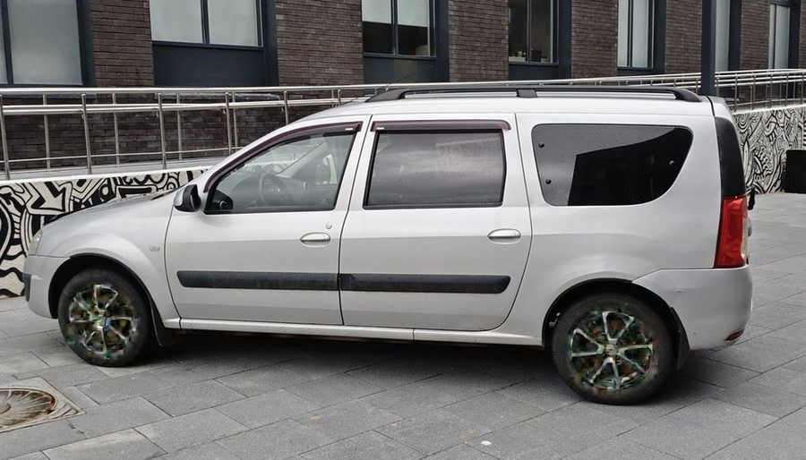

Gemini `gemini-3-pro-rim-mask`:

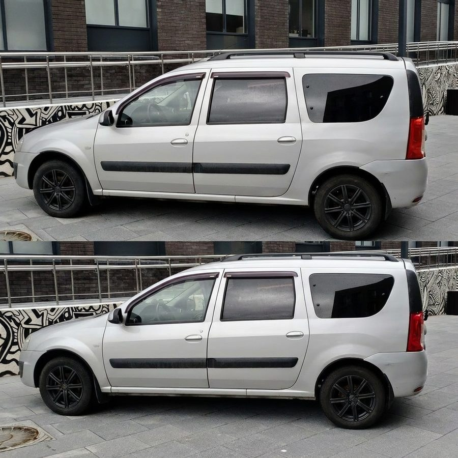

Reve direct API:

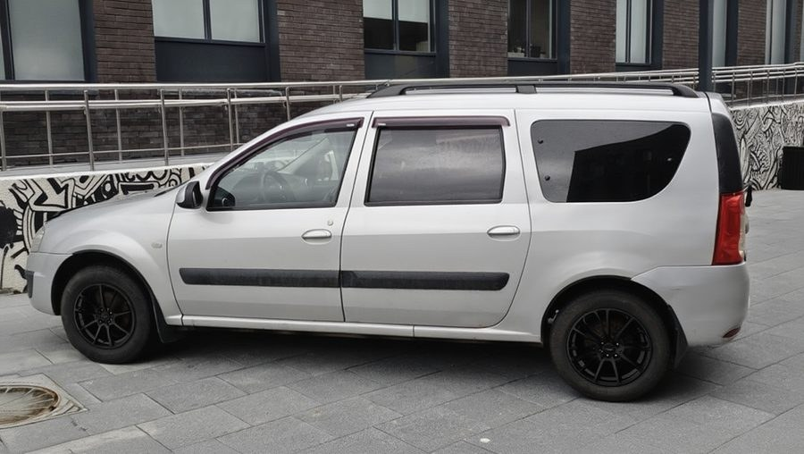

Visual notes:

- Flux produces the most direct masked replacement.
- Qwen changes the wheels, but the rim color/detail drifts away from the black
  reference.
- Gemini returned a two-image collage-like result, which is unusable for the
  product flow.
- Reve keeps the car image intact, but the wheels are closer to flat black disks
  than readable multi-spoke rims.

### `ivan-C2`

Source:


Mask:


Wheel source / target rim:


Flux `flux-s085-g25`:

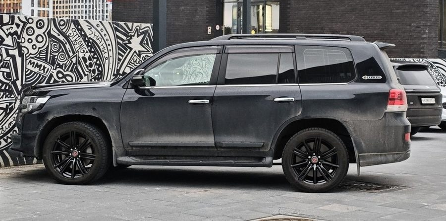

Qwen `qwen-edit-default`:

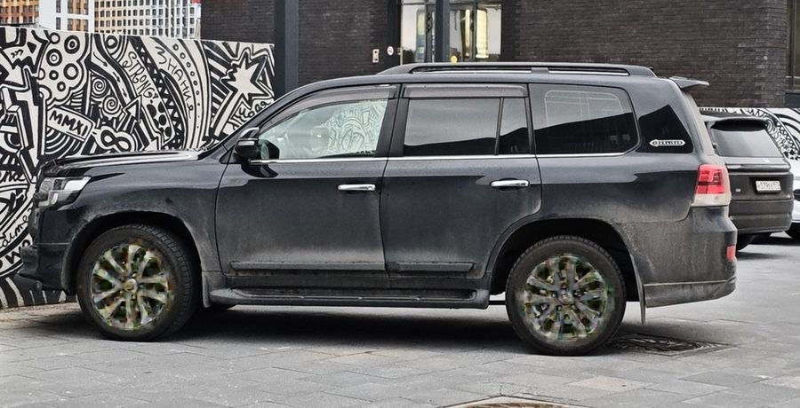

Gemini `gemini-3-pro-rim-mask`:

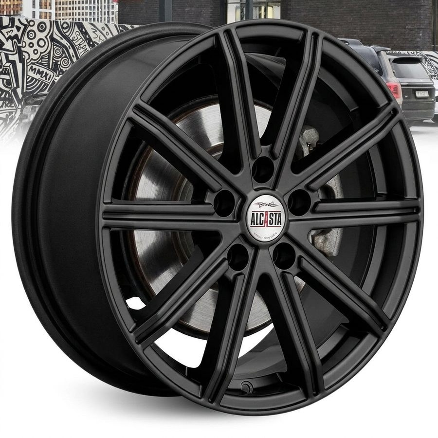

Reve direct API:

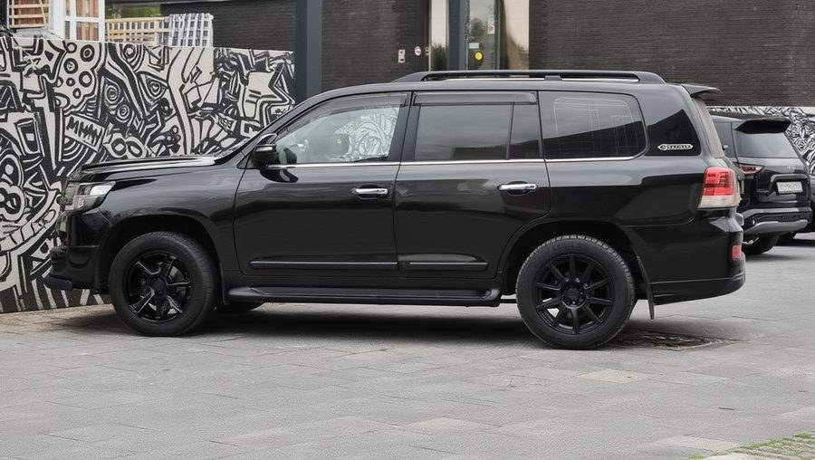

Visual notes:

- Flux is again the strongest masked replacement.
- Qwen makes the wheel structure too bright/greenish.
- Gemini inserts a standalone product-style wheel instead of editing the masked
  wheels on the car.
- Reve preserves the car and background, but the wheels are too dark and lose
  reference-rim detail.

### `ivan-N2`

Source:


Mask:


Wheel source / target rim:


Flux `flux-s085-g25`:


Qwen `qwen-edit-default`:

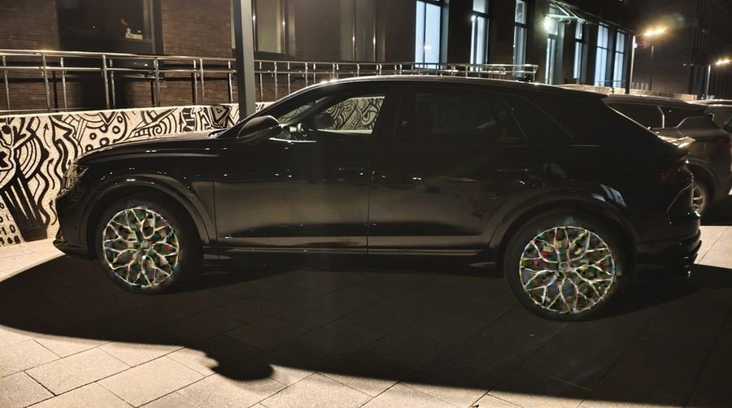

Gemini `gemini-3-pro-rim-mask`:

No completed output. The paid request timed out after 300 seconds.

Reve direct API:

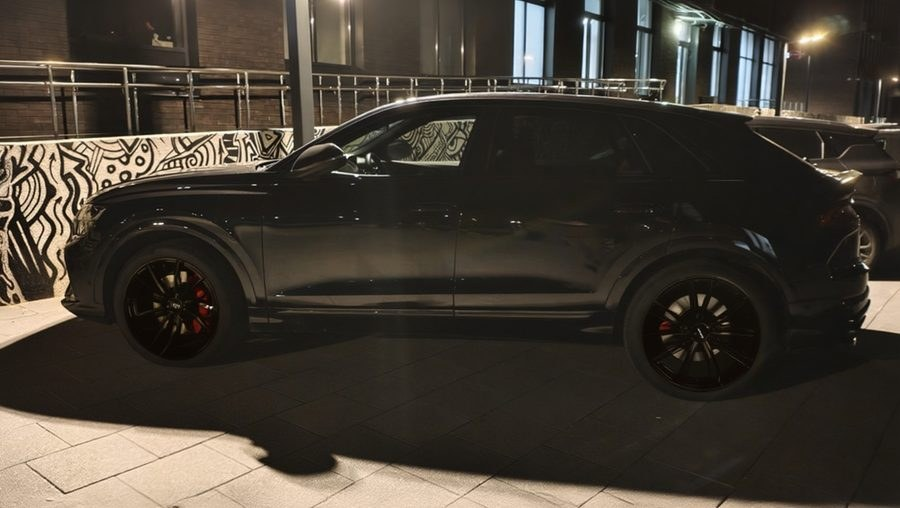

Visual notes:

- Flux is dark, but still the best current default for the black-rim target.
- Qwen preserves more spoke brightness, but drifts strongly from the black rim
  target.
- Gemini timed out.
- Reve completed, but shows reddish wheel artifacts and still loses spoke
  readability.

## Manifest

Create a JSONL manifest where each line is one case:

```json
{"id":"case-001","car_image":"data/cars/001.jpg","mask_image":"tmp/masks/001.png","reference_image":"data/rims/ref.png","wheel_description":"matte black 5-spoke rims"}
```

Required fields:

- `id`
- `car_image`
- `mask_image`
- `reference_image`

Optional field:

- `wheel_description` - used in the text prompt. `flux-kontext` also receives the
  reference image directly; `z-image` uses prompt + mask only.

## Prepare From Wheel-Labeling Dataset

For the local dataset:

```text
/Users/nikolai/Downloads/wheel_labeling_nikolai_70/images
```

and wheel references:

```text
/Users/nikolai/Documents/Dream Wheel AI/Ivan's Dataset/cars/rim1.jpg
```

build a budget-friendly 50-case manifest:

```bash
.venv/bin/python scripts/prepare_fal_eval_manifest.py \
  "/Users/nikolai/Downloads/wheel_labeling_nikolai_70/images" \
  "/Users/nikolai/Documents/Dream Wheel AI/Ivan's Dataset/cars/rim1.jpg" \
  --limit 50 \
  --max-long-edge 1024 \
  --output-dir tmp/fal-inpaint-eval/cases-rim1-1024 \
  --manifest tmp/fal-inpaint-eval/cases-rim1-1024.jsonl \
  --wheel-description "the reference matte black multi-spoke wheel rim design"
```

This creates free proxy masks from XML wheel boxes. These masks are not the final
Roboflow/Qwen masks, but the manifest format is identical, so generated masks can
be swapped in later.

Review before inference:

```text
tmp/fal-inpaint-eval/cases-rim1-1024/contact_sheet.jpg
```

## Dry Run

```bash
.venv/bin/python scripts/fal_inpaint_eval.py cases.jsonl \
  --preset wide \
  --limit 50 \
  --max-estimated-cost 2.50
```

Outputs:

- `tmp/fal-inpaint-eval/fal_inpaint_plan.jsonl`
- `tmp/fal-inpaint-eval/fal_inpaint_plan.csv`

The script checks:

- mask image exists;
- mask size equals car image size;
- mask is not empty;
- mask does not cover more than 35% of the image;
- estimated cost is under `--max-estimated-cost`.

Current dry-run numbers for `cases-rim1-1024.jsonl`:

- `wide`, 50 cases, `z-default + flux-s085-g25`: 100 planned requests, 2 skipped
  by preflight, estimated cost `$1.7075`.
- `tuning`, first 5 cases: 25 planned requests, estimated cost `$0.4177`.

## Paid Inference

```bash
FAL_KEY=... .venv/bin/python scripts/fal_inpaint_eval.py cases.jsonl \
  --preset wide \
  --limit 50 \
  --max-estimated-cost 2.50 \
  --execute
```

Results are written to:

- `tmp/fal-inpaint-eval/fal_inpaint_results.jsonl`
- `tmp/fal-inpaint-eval/fal_inpaint_results.csv`

## Presets

`wide`:

- `z-default`
- `flux-s085-g25`

Use this for 50-case coverage.

`flux-sweep`:

- `flux-s075-g25`
- `flux-s080-g25`
- `flux-s085-g25`
- `flux-s080-g35`
- `flux-default`

Use this for a focused Flux parameter sweep on a small set of real VLM masks.

`model-candidates`:

- `flux-s085-g25`
- `flux-dev-s085-g35`
- `flux-general-s085-g35`
- `z-default`
- `sdxl-default`

Use this for a small cross-model smoke comparison. `flux-s085-g25` is the only
candidate in this preset that receives the wheel reference image directly.

`night-flux`:

- `flux-s075-g25`
- `flux-s080-g25`
- `flux-s085-g25`
- `flux-s080-g35`
- `flux-s085-g35`

Use this for night-only tuning where wheel readability competes with black-rim
style adherence.

`frontier-edit`:

- `flux-s085-g25`
- `qwen-edit-default`
- `reve-remix-rim-mask`
- `gemini-3-pro-rim-mask`

Use this only for a small comparison set. It includes expensive/slow image edit
models and does not have the same strict mask semantics as Flux inpainting.

`tuning`:

- `z-default`
- `z-strong`
- `flux-default`
- `flux-guidance-45`
- `flux-quality`

Use this only on a small subset, usually 5 cases.

## Budget Notes

The runner estimates cost from car image megapixels.

- `fal-ai/flux-kontext-lora/inpaint`: `$0.035/MP`
- `fal-ai/z-image/turbo/inpaint`: `$0.01/MP`
- `fal-ai/qwen-image-edit/inpaint`: `$0.03/MP`
- `fal-ai/reve/fast/remix`: local planning estimate `$0.01/image`
- `fal-ai/gemini-3-pro-image-preview/edit`: local planning estimate `$0.15/image`

The Z-Image estimate is conservative because fal pages currently show both
`$0.005/MP` and `$0.01/MP` in different places.

## Flux Parameter Sweep Notes

The first paid Flux sweep used three real VLM-mask cases:

- `ivan-C1` - white car, daylight.
- `ivan-C2` - dark gray SUV, daylight.
- `ivan-N2` - dark car, night.

Command shape:

```bash
.venv/bin/python scripts/fal_inpaint_eval.py \
  tmp/fal-inpaint-eval/ivan-flux-param-tune-3cases.jsonl \
  --preset flux-sweep \
  --output-dir tmp/fal-inpaint-eval/results-flux-param-tune-real-masks \
  --max-estimated-cost 0.40 \
  --execute
```

Observed outputs:

- 15/15 requests completed.
- Total estimated cost: `$0.3021`.
- Local comparison sheets:
  - `tmp/fal-inpaint-eval/results-flux-param-tune-real-masks/flux_param_tune_contact_sheet.jpg`
  - `tmp/fal-inpaint-eval/results-flux-param-tune-real-masks/flux_param_tune_zoom_sheet_scaled.jpg`

Current visual read:

- `flux-default` is a useful baseline, but not the best production candidate.
  It tends to make night wheels too dark/empty.
- `flux-s080-g25` preserves more bright spoke detail, but often drifts away from
  the black reference rim.
- `flux-s080-g35` and `flux-default` are darker and more prompt-adherent, but can
  lose rim structure in low light.
- `flux-s085-g25` is the best current compromise across the three cases: black
  rim style, enough spoke structure, and fewer night-case failures than
  `flux-default`.

Important integration caveat: `fal-ai/flux-kontext-lora/inpaint` may return a
different output resolution than the input image. In the first sweep, a
`1024x594` input produced `1328x800` outputs. Any production integration should
either request/verify exact sizing if the endpoint supports it or resize the
final image back to the original dimensions before handing it to downstream code.

## Model Candidate Sweep Notes

The first cross-model sweep used the same three real VLM-mask cases and initially
tested:

- `flux-s085-g25`
- `flux-dev-s085-g35`
- `flux-krea-s085-g35`
- `flux-general-s085-g35`
- `z-default`
- `sdxl-default`

Observed status:

- 15/18 requests completed.
- `flux-krea-s085-g35` timed out on all three cases, so it was removed from the
  `model-candidates` preset.
- Current no-Krea dry-run: 3 cases, 15 planned requests, estimated `$0.2331`.
- Local comparison sheet:
  - `tmp/fal-inpaint-eval/results-model-candidates-3cases/model_candidates_contact_sheet_no_krea.jpg`

Early visual read:

- `flux-s085-g25` remains the best reference-driven candidate.
- `flux-dev-s085-g35` and `flux-general-s085-g35` are viable prompt+mask
  baselines, but they do not receive the wheel reference image.
- `z-default` often preserves/creates brighter spokes and can drift from the
  black rim target.
- `sdxl-default` changes framing/aspect enough that it is a weak production
  candidate without additional sizing controls.

## OpenAI Image Edit Baseline

OpenAI image edits are tracked as a separate managed baseline because the API
returns base64 image data and uses a different mask convention than fal.ai.

Runner:

```bash
.venv/bin/python scripts/openai_image_edit_eval.py \
  tmp/fal-inpaint-eval/ivan-cars-rim1-1024-vlm-masks-selected.jsonl \
  --limit 6 \
  --output-dir tmp/openai-image-edit-eval/ivan-vlm-6cases
```

Paid run:

```bash
OPENAI_API_KEY=... .venv/bin/python scripts/openai_image_edit_eval.py \
  tmp/fal-inpaint-eval/ivan-cars-rim1-1024-vlm-masks-selected.jsonl \
  --limit 6 \
  --output-dir tmp/openai-image-edit-eval/ivan-vlm-6cases \
  --execute
```

The runner sends:

- first input image: the car image to edit;
- second input image: the rim reference image;
- `mask`: an RGBA alpha mask derived from the Stage 2 binary wheel mask.

Mask convention: Stage 2 masks are white where wheels should be edited. OpenAI
image edits use transparent alpha pixels as editable regions, so the runner
converts white wheel pixels to transparent and keeps all other pixels opaque.

Outputs:

- `openai_image_edit_plan.jsonl`
- `openai_image_edit_plan.csv`
- `openai_masks/*.openai-alpha-mask.png`
- `openai_image_edit_results.jsonl`
- `openai_image_edit_results.csv`
- `outputs/*.png`

Current local status: runner and dry-run path are implemented; paid execution
requires `OPENAI_API_KEY`. Default model is `gpt-image-2`.

## Night Flux Sweep Notes

The night-only Flux sweep used `ivan-N1`, `ivan-N2`, and `ivan-N3` with real VLM
masks:

```bash
.venv/bin/python scripts/fal_inpaint_eval.py \
  tmp/fal-inpaint-eval/ivan-vlm-night-3cases.jsonl \
  --preset night-flux \
  --output-dir tmp/fal-inpaint-eval/results-flux-night-sweep \
  --max-estimated-cost 0.40 \
  --execute
```

Observed outputs:

- 15/15 requests completed.
- Total estimated cost: `$0.3097`.
- Local comparison sheets:
  - `tmp/fal-inpaint-eval/results-flux-night-sweep/night_sweep_contact_sheet.jpg`
  - `tmp/fal-inpaint-eval/results-flux-night-sweep/night_sweep_zoom_sheet.jpg`

Current visual read:

- `flux-s075-g25` is the best night readability candidate. It keeps more spoke
  detail visible, especially on `ivan-N2`, where stronger settings can collapse
  into a black disk.
- `flux-s085-g25` remains the better all-around/default candidate because it
  adheres more strongly to the black reference rim style on daylight cases.
- `flux-s080-g35` can improve contrast on some night wheels, but it is less
  stable and produced an obviously wrong steel-wheel-like result on `ivan-N1`.
- `flux-s085-g35` is usually too dark for night cases.

## Reference Candidate Sweep Notes

The short reference-conditioning sweep used the same three cases as the model
candidate sweep:

- `ivan-C1` - white car, daylight.
- `ivan-C2` - dark gray SUV, daylight.
- `ivan-N2` - dark car, night.

It compared the current Flux Kontext candidates against two fal.ai reference
alternatives:

- `flux-general-reference-rim` - `fal-ai/flux-general/inpainting` with
  `reference_image_url`.
- `qwen-edit-default` - `fal-ai/qwen-image-edit/inpaint`.

Command:

```bash
.venv/bin/python scripts/fal_inpaint_eval.py \
  tmp/fal-inpaint-eval/ivan-flux-param-tune-3cases.jsonl \
  --preset reference-candidates \
  --output-dir tmp/fal-inpaint-eval/results-reference-candidates-3cases \
  --max-estimated-cost 0.40 \
  --execute \
  --client-timeout 240
```

Observed outputs:

- 12/12 requests completed.
- Total estimated cost: `$0.2331`.
- Local comparison sheets:
  - `tmp/fal-inpaint-eval/results-reference-candidates-3cases/reference_candidates_contact_sheet.jpg`
  - `tmp/fal-inpaint-eval/results-reference-candidates-3cases/reference_candidates_zoom_sheet.jpg`

Current visual read:

- `qwen-edit-default` is fast and inexpensive, but it appears weaker for
  faithful rim replacement in this masked workflow.
- `flux-general-reference-rim` accepts the built-in reference parameter and is a
  useful experiment, but its output resolution differs from the input and still
  needs stricter visual review before it can replace Flux Kontext.
- `flux-s085-g25` remains the safest all-around production candidate.
- `flux-s075-g25` remains the best night readability fallback.

## Frontier Edit Sweep Notes

The frontier edit sweep compared the current Flux/Qwen candidates against Gemini
and direct Reve remix on the same three cases:

- `ivan-C1` - white car, daylight.
- `ivan-C2` - dark gray SUV, daylight.
- `ivan-N2` - dark car, night.

fal.ai command:

```bash
.venv/bin/python scripts/fal_inpaint_eval.py \
  tmp/fal-inpaint-eval/ivan-flux-param-tune-3cases.jsonl \
  --preset frontier-edit \
  --output-dir tmp/fal-inpaint-eval/results-frontier-edit-3cases \
  --max-estimated-cost 0.80 \
  --execute \
  --client-timeout 300
```

Direct Reve command:

```bash
.venv/bin/python scripts/reve_image_edit_eval.py \
  tmp/fal-inpaint-eval/ivan-flux-param-tune-3cases.jsonl \
  --limit 3 \
  --output-dir tmp/reve-image-edit-eval/ivan-vlm-3cases-direct \
  --execute \
  --timeout 240
```

Observed outputs:

- fal frontier sweep: 8/12 completed.
- `flux-s085-g25`: 3/3 completed.
- `qwen-edit-default`: 3/3 completed.
- `gemini-3-pro-rim-mask`: 2/3 completed; `ivan-N2` timed out at 300 seconds.
- `reve-remix-rim-mask` through fal initially failed validation because the
  endpoint expected `image_urls`; the local config was corrected afterward.
- direct Reve: 3/3 completed after retrying one transient SSL failure.
- Local comparison sheets:
  - `tmp/reve-image-edit-eval/frontier-comparison-3cases/frontier_comparison_contact_sheet.jpg`
  - `tmp/reve-image-edit-eval/frontier-comparison-3cases/frontier_comparison_zoom_sheet.jpg`

Current visual read:

- `flux-s085-g25` remains the best all-around candidate in this comparison.
- `qwen-edit-default` keeps the car framing, but tends to make rim structure too
  bright/greenish and is less faithful to the black reference rim.
- `gemini-3-pro-rim-mask` is not usable as a masked wheel-edit baseline in this
  setup: one output became a two-image collage, and another inserted a standalone
  product-style wheel instead of editing only the masked rims.
- Direct Reve technically works and preserves the car framing, but the outputs
  often become flat black wheels with weak spoke detail; the night case also
  shows reddish artifacts.
