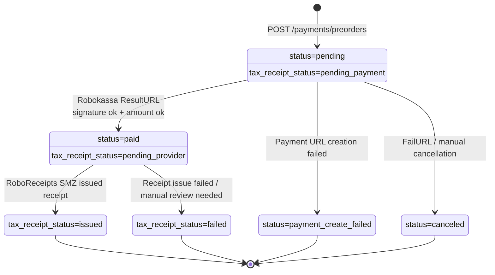

# Robokassa Payment Pipeline

## Sequence Diagram

```mermaid
sequenceDiagram
    autonumber
    actor User as User
    participant Frontend as Frontend
    participant Backend as FastAPI Backend
    database DB as Postgres / preorders
    participant Robokassa as Robokassa
    participant NPD as RoboReceipts SMZ / My Tax

    User->>Frontend: Enters email and clicks "Prepay"
    Frontend->>Backend: POST /payments/preorders
    Backend->>DB: INSERT preorder<br/>status=pending
    DB-->>Backend: preorder_id, invoice_id
    Backend->>Backend: Builds SignatureValue<br/>Password #1
    Backend-->>Frontend: confirmation_url

    Frontend->>Robokassa: Redirects to payment form
    User->>Robokassa: Pays by card / SBP / pay service

    Robokassa->>Backend: POST /payments/robokassa/result<br/>OutSum, InvId, SignatureValue
    Backend->>Backend: Verifies SignatureValue<br/>Password #2
    Backend->>DB: SELECT preorder by invoice_id
    DB-->>Backend: amount_value, status
    Backend->>Backend: Verifies amount
    Backend->>DB: UPDATE preorder<br/>status=paid<br/>tax_receipt_status=pending_provider
    Backend-->>Robokassa: OK&lt;InvId&gt;

    Robokassa->>NPD: Issues NPD receipt<br/>via RoboReceipts SMZ
    NPD-->>User: Sends receipt to buyer

    Frontend->>Backend: GET /payments/preorders/{preorder_id}
    Backend->>DB: SELECT preorder status
    DB-->>Backend: paid / pending
    Backend-->>Frontend: status, tax_receipt_status
    Frontend-->>User: Shows payment result
```

## State Diagram


